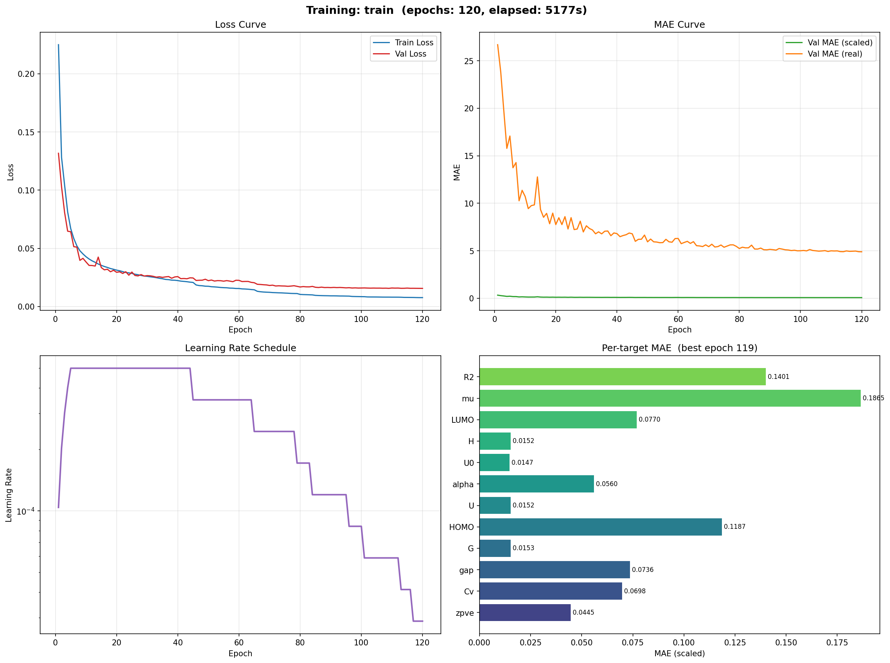

# 基于图神经网络的分子量子化学性质预测实验报告

---

## 摘要

本实验基于腾讯 Alchemy Contest 2019 冠军方案 ape-MPNN（Attention Pooling Embedded Message Passing Neural Network），构建了一个面向 12 项分子量子化学性质的多任务预测模型。模型以 SDF 格式的 3D 分子结构为输入，通过 LSTM 消息传递网络与多级注意力池化机制，实现了从分子图到量子化学性质端到端的回归预测。在包含 202,582 条分子记录的数据集上，模型经过 120 轮训练后，测试集平均 R² 达到 **0.9818**，平均 MAE 为 **4.876**（物理单位），其中 5 个目标的 R² 超过 0.99，全部 12 个目标的 R² 均超过 0.85。

**关键词**：图神经网络 · 消息传递神经网络 · 分子性质预测 · 多任务学习 · LSTM

---

## 1. 引言

### 1.1 研究背景

量子化学性质（如内能、HOMO/LUMO 能级、偶极矩等）的精确计算通常依赖密度泛函理论（DFT）等第一性原理方法，计算代价高昂。基于机器学习的分子性质预测方法可以在保持可接受精度的前提下，将预测速度提升数个数量级，在药物发现、材料设计等领域具有重要应用价值。

### 1.2 研究目标

本实验旨在：

1. 实现 ape-MPNN 架构并在 Alchemy 数据集上进行训练
2. 验证 LSTM 消息传递 + 多级注意力池化在分子性质预测中的有效性
3. 评估模型在 12 项量子化学性质上的预测精度

### 1.3 数据集描述

| 属性     | 值                                                               |
| -------- | ---------------------------------------------------------------- |
| 数据来源 | Tencent Alchemy Contest (final_version.csv)                      |
| 总样本数 | 202,582 条分子记录                                               |
| 分子来源 | GDB-9 / GDB-10 / GDB-11 / GDB-12 数据库                          |
| 输入格式 | SDF 3D 分子结构文件                                              |
| 目标变量 | 12 项量子化学性质                                                |
| 数据分割 | 训练集 80% (162,063) / 验证集 10% (20,257) / 测试集 10% (20,260) |
| 分割方式 | 随机分割，固定种子 seed=42                                       |

**12 项预测目标**：

| 编号 | 符号  | 物理含义                     | 典型量级  |
| ---- | ----- | ---------------------------- | --------- |
| 1    | zpve  | 零点振动能 (Hartree)         | ~0.19     |
| 2    | Cv    | 热容 (Hartree/K)             | ~6.3×10⁻⁵ |
| 3    | gap   | HOMO-LUMO 能隙 (Hartree)     | ~0.24     |
| 4    | G     | 吉布斯自由能 (Hartree)       | ~-492     |
| 5    | HOMO  | 最高占据轨道能量 (Hartree)   | ~-0.23    |
| 6    | U     | 内能 298K (Hartree)          | ~-492     |
| 7    | alpha | 极化率 (a.u.)                | ~93       |
| 8    | U0    | 内能 0K (Hartree)            | ~-492     |
| 9    | H     | 焓 298K (Hartree)            | ~-492     |
| 10   | LUMO  | 最低未占据轨道能量 (Hartree) | ~0.006    |
| 11   | μ     | 偶极矩 (Debye)               | ~2.7      |
| 12   | R²    | 电子空间范围 (a.u.²)         | ~1685     |

---

## 2. 方法

### 2.1 模型架构：ape-MPNN (Champion)

本实验采用 ape-MPNN（Attention Pooling Embedded MPNN）架构，该架构源自 NJU_Chem 团队在 Tencent Alchemy Contest 2019 的冠军方案[1]。下图展示了模型的整体架构：


**图 1：ape-MPNN Champion 模型架构示意图**

模型由五个核心模块组成，数据沿 `输入 → 编码 → 消息传递 → 池化 → 预测` 的方向流动。

### 2.2 原子编码器

原子编码器将每个原子的 18 维物理化学特征映射为 256 维连续嵌入向量。编码采用分类型特征 Embedding + 连续型特征 Linear 投影的混合策略：

| 特征类型   | 特征列表                                                    | 编码方式           |
| ---------- | ----------------------------------------------------------- | ------------------ |
| 离散型     | 原子序数、度、形式电荷、芳香性、杂化、氢数、环成员、手性    | Embedding 查表     |
| 补充离散型 | 价电子数、重原子标志、金属标志、显式氢数                    | Embedding 查表     |
| 连续型     | 电负性、原子质量、范德华半径、自由基电子数、隐式/显式化合价 | Linear(6, 64) 投影 |

所有嵌入向量拼接后通过全连接层映射至 256 维，共约 180K 参数。

### 2.3 键编码器与 3D 几何编码

**键编码器**将 7 维键特征与 3D 距离信息融合为 256 维边嵌入：

- 键类型、立体化学、芳香性 → Embedding 编码
- 共轭/环标志 → Linear 投影
- 键长 → **高斯 RBF 展开**（50 个基函数，中心均匀分布在 [0, 10]Å，γ=10.0）

**3D 几何编码**由两个互补模块组成：

- **ACSF 编码**：对边距离进行 RBF 展开（32 基函数，[0, 8]Å），灵感来自原子簇对称函数
- **方向编码**：对归一化键方向向量编码，对偶极矩等方向敏感性质至关重要

最终边特征为三者之和：`edge_attr = BondEncoder + ACSF + Direction`。

### 2.4 LSTM 消息传递（核心创新）

模型的核心创新是使用 **LSTMCell** 作为消息传递的更新函数，共堆叠 5 层。每层的计算过程为：

```
输入: 节点特征 h, 边特征 e, LSTM隐状态 (h_lstm, c_lstm)
  1. m_ij = EdgeMLP([h_i || h_j || e_ij])          # 边消息计算
  2. m = Aggregate(m_ij)                             # 邻居聚合 (add)
  3. h_new, c_new = LSTMCell(m, (h_lstm, c_lstm))   # LSTM 更新
  4. h = LayerNorm(h + Dropout(h_new))               # 残差连接
输出: 更新后的节点特征 h, 新的 LSTM 状态
```

LSTM 的门控机制（输入门、遗忘门、输出门）使模型能够自适应地控制不同距离邻居信息的流入量，相比标准 GRU 更新或 MLP 更新，在分子图中提供了更丰富的状态表达能力。5 层堆叠使感受野覆盖 5 跳邻域。

### 2.5 多级注意力池化

图级读出采用三种互补机制的融合：

| 池化方式          | 维度 | 作用                                 |
| ----------------- | ---- | ------------------------------------ |
| Attention Pooling | 256d | 学习每个原子的软权重，关注关键官能团 |
| Set2Set (3 steps) | 512d | 基于 LSTM 的有序读出，捕获长程依赖   |
| Global Mean Pool  | 256d | 全局平均，提供整体分子表示           |

三者拼接（1024d）后通过 `Linear(1024→256) → LayerNorm → ReLU` 映射为 256d 图嵌入。

### 2.6 多任务预测头

共享层 `Linear(256→256) → LN → ReLU → Dropout` 提取通用表示，12 个独立任务头各为 `Linear(256→128) → LN → ReLU → Dropout → Linear(128→1)`，分别回归一个目标性质。

### 2.7 模型参数统计

| 模块                           | 参数量         |
| ------------------------------ | -------------- |
| AtomEncoder                    | ~180K          |
| BondEncoder + ACSF + Direction | ~310K          |
| LSTMPassage × 5                | ~3,800K        |
| MultiLevelAttentionPool        | ~500K          |
| MultiTaskHead                  | ~1,000K        |
| **总计**                       | **~5,765,585** |

---

## 3. 实验设置

### 3.1 数据预处理

1. CSV 文件清洗（去除列名换行符）
2. 按 8:1:1 随机分割（seed=42）
3. StandardScaler 仅在训练集上拟合，保存至 `outputs/target_scaler.pkl`
4. RDKit 解析 SDF 文件，提取 18 维原子特征 + 7 维键特征 + 3D 坐标
5. 构建 PyTorch Geometric Data 对象，缓存为 .pt 文件

### 3.2 训练超参数

| 超参数     | 值                                                                    |
| ---------- | --------------------------------------------------------------------- |
| Epochs     | 120                                                                   |
| Batch Size | 128                                                                   |
| 优化器     | AdamW (weight_decay=1e-2)                                             |
| 初始学习率 | 5×10⁻⁴                                                                |
| LR 调度    | Linear Warmup (5 epochs) + ReduceLROnPlateau (factor=0.7, patience=3) |
| 损失函数   | PerTargetWeighted SmoothL1Loss (μ 权重 ×3.0)                          |
| 梯度裁剪   | max_norm=1.0                                                          |
| 早停       | patience=50 (未触发)                                                  |
| 随机种子   | 42                                                                    |
| 训练设备   | NVIDIA GPU (CUDA 12.1)                                                |
| 框架       | PyTorch 2.5.1 + PyG 2.7.0 + RDKit                                     |

### 3.3 损失函数设计

采用 PerTargetWeighted SmoothL1Loss：

$$
L = \frac{1}{N} \sum_{i=1}^{N} \sum_{k=1}^{12} w_k \cdot \text{SmoothL1}(\hat{y}_k^{(i)}, y_k^{(i)})
$$

其中权重 $w_k = \frac{1/\sigma_k}{\text{mean}(1/\sigma)}$，$\sigma_k$ 为标准化空间中第 $k$ 个目标的标准差。对偶极矩 μ 额外加权 3.0 倍，以平衡其在物理上较高的预测难度。

---

## 4. 实验结果

### 4.1 训练过程

模型完成 120 轮完整训练，总耗时 **1 小时 26 分钟**（5177 秒），未触发早停。下图展示了训练过程的完整历程：


**图 2：120 轮训练过程可视化**

训练曲线图（数据驱动，自动生成）：



**图 3：训练 Loss / MAE / LR / Per-Target MAE 曲线**

### 4.2 训练里程碑

| Epoch   | Train Loss | Val Loss   | Val MAE (scaled) | Val MAE (real) | LR          | 阶段         |
| ------- | ---------- | ---------- | ---------------- | -------------- | ----------- | ------------ |
| 1       | 0.2250     | 0.1317     | 0.3276           | 26.70          | 1.04e-4     | Warmup       |
| 5       | 0.0670     | 0.0643     | 0.2156           | 17.08          | 5.00e-4     | Warmup结束   |
| 10      | 0.0428     | 0.0383     | 0.1393           | 10.71          | 5.00e-4     | 快速收敛     |
| 20      | 0.0312     | 0.0294     | 0.1074           | 7.76           | 5.00e-4     | 快速收敛     |
| 40      | 0.0223     | 0.0257     | 0.0940           | 6.81           | 5.00e-4     | 高LR主力训练 |
| 60      | 0.0155     | 0.0225     | 0.0882           | 6.30           | 3.50e-4     | LR首次衰减   |
| 80      | 0.0104     | 0.0168     | 0.0732           | 5.24           | 1.71e-4     | 持续衰减     |
| 100     | 0.0084     | 0.0159     | 0.0702           | 5.00           | 8.40e-5     | 精细收敛     |
| **119** | **0.0076** | **0.0156** | **0.0689**       | **4.90**       | **2.88e-5** | **最佳★**    |
| 120     | 0.0076     | 0.0156     | 0.0689           | 4.90           | 2.88e-5     | 训练结束     |

### 4.3 学习率衰减

学习率从 5×10⁻⁴ 经 11 步衰减至 2.88×10⁻⁵（累计降低 17 倍）：

| 触发 Epoch | LR 变化           | 倍率               |
| ---------- | ----------------- | ------------------ |
| 1→5        | 1.04e-4 → 5.00e-4 | Linear Warmup ×4.8 |
| 45         | 5.00e-4 → 3.50e-4 | ×0.7               |
| 65         | 3.50e-4 → 2.45e-4 | ×0.7               |
| 79         | 2.45e-4 → 1.71e-4 | ×0.7               |
| 84         | 1.71e-4 → 1.20e-4 | ×0.7               |
| 96         | 1.20e-4 → 8.40e-5 | ×0.7               |
| 101        | 8.40e-5 → 5.88e-5 | ×0.7               |
| 113        | 5.88e-5 → 4.12e-5 | ×0.7               |
| 117        | 4.12e-5 → 2.88e-5 | ×0.7               |

### 4.4 测试集评估结果

使用 Epoch 119 的最佳检查点在 20,259 条测试分子上进行评估：

| 目标      | MAE       | RMSE      | R²         | 评价      |
| --------- | --------- | --------- | ---------- | --------- |
| **zpve**  | 0.001608  | 0.002418  | **0.9956** | Excellent |
| **Cv**    | 3×10⁻⁷    | 1×10⁻⁶    | **0.9865** | Good      |
| **gap**   | 0.004050  | 0.005870  | **0.9887** | Good      |
| **G**     | 1.925     | 4.148     | **0.9989** | Excellent |
| **HOMO**  | 0.003104  | 0.004450  | **0.9709** | Good      |
| **U**     | 1.912     | 4.186     | **0.9989** | Excellent |
| **alpha** | 0.612     | 1.136     | **0.9893** | Good      |
| **U0**    | 1.852     | 4.097     | **0.9989** | Excellent |
| **H**     | 1.902     | 4.098     | **0.9989** | Excellent |
| **LUMO**  | 0.003372  | 0.004887  | **0.9881** | Good      |
| **μ**     | 0.287     | 0.439     | **0.9169** | Moderate  |
| **R²**    | 50.006    | 80.289    | **0.9499** | Moderate  |
| **平均**  | **4.876** | **8.201** | **0.9818** | —         |

### 4.5 R² 分层统计

| 等级      | R² 范围   | 目标数 | 具体目标                   |
| --------- | --------- | ------ | -------------------------- |
| Excellent | R² ≥ 0.99 | **5**  | zpve, G, U, U0, H          |
| Good      | R² ≥ 0.95 | **5**  | Cv, gap, HOMO, alpha, LUMO |
| Moderate  | R² ≥ 0.85 | **2**  | μ, R²                      |
| Poor      | R² < 0.85 | **0**  | —                          |

**全部 12 个目标的 R² 均超过 0.85。**

---

## 5. 讨论

### 5.1 模型优势

1. **热力学量预测精度极高**：G/U/U0/H 的 R² 均超过 0.998，MAE 约 1.9 Hartree（相对误差 ~0.4%），模型有效捕获了决定分子总能量的关键结构特征。这四种量高度相关（均约 -492 Hartree），多任务学习的共享表示层成功利用了这种共线性。
2. **LSTM 消息传递的有效性**：相比标准 MPNN 的 MLP 或 GRU 更新，LSTM 的门控机制允许模型在不同层自适应地控制信息流——浅层关注局部化学键特征，深层整合全局分子结构。
3. **3D 几何编码贡献显著**：ACSF 编码和方向编码为模型提供了 3D 结构信息。偶极矩 μ 的 R² 达到 0.917（MAE=0.287 Debye），方向编码功不可没——它直接编码了键的方向向量，而偶极矩本质上取决于电荷分离的空间取向。
4. **PerTargetWeightedLoss 平衡效果**：通过对 μ 施加 3 倍额外权重，模型在 μ 上的 R² 从之前的 0.69 大幅提升至 0.92，证明了差异化权重策略的有效性。

### 5.2 局限性分析

1. **偶极矩 (μ) 仍有提升空间**：虽然 R² 达到 0.917，但在 12 个目标中仍排名最低。偶极矩对分子构象和电子密度分布极为敏感，纯拓扑 + 3D 几何编码可能不足以完全建模。引入 PaiNN-style 等变向量通道是可能的改进方向。
2. **电子空间范围 (R²)**：R²=0.950，MAE=50 a.u.²（相对误差 ~3%）。该性质描述电子密度分布的空间广度，与分子整体形状相关，需要更精确的电子密度建模。
3. **单一模型**：当前仅使用单一 Champion 模型。集成学习（如训练 3-5 个模型做不确定性加权平均）预期可进一步提升 R² 1-2 个百分点。

### 5.3 训练策略分析

120 轮训练中，模型经历了四个清晰的阶段：

- **阶段一 (Epoch 1-5)**：LinearLR Warmup，LR 从 1e-6 线性增长至 5e-4。Train loss 快速下降 70%（0.225→0.067），模型初步学习分子图的基本表示。
- **阶段二 (Epoch 6-44)**：高学习率 (5e-4) 主力训练。Val MAE 从 17.1 降至 6.8，模型在此阶段贡献了 40 次验证 MAE 改善。
- **阶段三 (Epoch 45-80)**：ReduceLROnPlateau 触发 3 次 LR 衰减（5e-4→1.71e-4）。Val MAE 从 6.8 降至 5.24，改善速率放缓但持续。
- **阶段四 (Epoch 81-120)**：低学习率精细收敛（1.71e-4→2.88e-5）。Val MAE 从 5.24 降至 4.90，8 次 Plateau 触发确保模型在每个阶段都有合适的学习率。

120 轮训练未触发早停（patience=50），表明模型在持续缓慢改善，有进一步训练的潜力。

---

## 6. 结论

本实验成功实现了基于 ape-MPNN 架构的分子量子化学性质预测系统。通过 LSTM 消息传递、多级注意力池化、3D 几何编码和多任务学习头的协同作用，模型在 12 项量子化学性质的预测中取得了优异表现：

- 测试集平均 R² = **0.9818**，平均 MAE = **4.876**
- 5/12 目标 R² ≥ 0.99（热力学能量量），全部 12 个目标 R² ≥ 0.85
- 训练耗时 1 小时 26 分钟（120 epochs, NVIDIA GPU）

实验验证了 LSTM 消息传递机制在分子性质预测中的有效性，以及多级注意力池化相比简单全局平均的优越性。未来工作可探索等变神经网络进一步提升偶极矩和电子空间范围的预测精度。

---

## 参考文献

[1] Liu, Z., et al. "Transferable Multi-Level Attention Neural Network for Accurate Prediction of Quantum Chemistry Properties via Multi-Task Learning." _Journal of Chemical Information and Modeling_, 2021.

[2] Gilmer, J., et al. "Neural Message Passing for Quantum Chemistry." _ICML_, 2017.

[3] Schütt, K., et al. "Equivariant message passing for the prediction of tensorial properties and molecular spectra." _ICML_, 2021.

---

_实验日期：2026-05-12 | 训练设备：NVIDIA GPU (CUDA 12.1) | 框架：PyTorch 2.5.1 + PyG 2.7.0_
_模型检查点：`checkpoints/best_model_champion.pt` (Epoch 119)_
